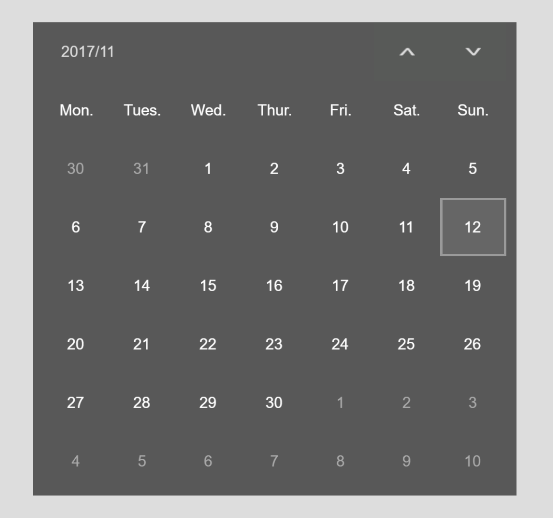

# Egret-Calendar

A Calendar Component by Egret engine.

## Requirements

* Egret 4.11+

## API

```js
// get an instance of the calendar component
let myCalendar = Calendar.getInstance();

// set the position & size ( width ) of the calendar
myCalendar.setPosition(50, 100, 1000);

// get the selected date
myCalendar.getSelectedDate();

```

## Demo

